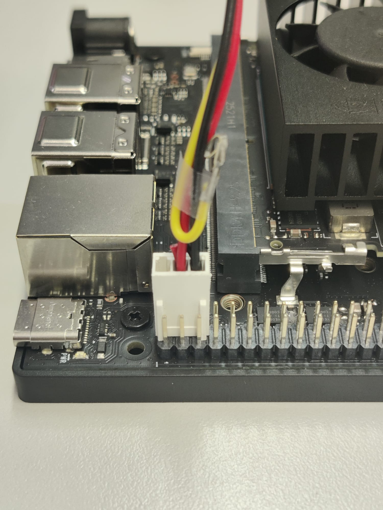

# Adapting a Tower Fan for the Jetson Orin Nano

This guide explains how to adapt a standard tower fan for use with the **Jetson Orin Nano**, providing an effective and low-cost cooling solution for your Jetson cluster setup.

---

## Overview

Old PC tower fans often use one of two connector types:
- **Molex (4-pin)** for power supply units.
- **3-pin motherboard fan connector** (as shown in *Image 1*).

Unfortunately, the **Jetson Orin Nano** does not support either of these connection types directly.  
In this tutorial, we’ll modify the fan so it can be powered through the **GPIO header** on the Jetson.

---

## Step 1: Identify the Fan Wires

Most PC fans have three wires:

| Wire Color | Function | Description |
|-------------|-----------|-------------|
| **Red** | +12V | Power supply (positive) |
| **Black** | GND | Ground (negative) |
| **Yellow** | Tach | Speed control / feedback signal |

For our setup, we’ll only use **two wires**:
- **Red** (power)
- **Black** (ground)

The **yellow** TACH wire will be removed.

---

## Step 2: Check the Jetson Orin Nano Pinout

Refer to the Jetson Orin Nano pinout diagram (*Image 2*).  
You’ll find that:

| Pin | Function |
|------|-----------|
| **Pin 2 / Pin 4** | +5V |
| **Pin 6** | GND |

Notice that there are **no 12V pins** available on the Jetson.  
However, running a 12V fan at 5V **won’t damage it**, simply makes it spin more slowly and quietly. till providing enough airflow for most cooling needs.

For more cooling power, you can use an **external 12V power supply** and control the fan through a **transistor or relay** from the GPIO pins.

---

## Step 3: Prepare the Fan Cable

To make things neater:
1. **Cut off the Molex connector** (optional, but recommended to save space).
2. Keep the **3-pin connector**. This will be used for the GPIO connection.

Now we need to wire it so that:
- The **red wire** connects to **Pin 4 (5V)**.
- The **black wire** connects to **Pin 6 (GND)**.

## Step 4: Remove Tachometric Signal

Receiving 5V from the yellow wire would set the fan to its lowest possible speed. However, since the fan is already operating well below its rated 12V, it is likely spinning below its minimum nominal speed anyway, so this won’t cause any issues.

Still, we’ll remove this wire to make sure it doesn’t further reduce the fan’s speed, and because we’ll need the slot it frees up in the next step.

To extract the cable:
    1. Using a small flat screwdriver or terminal extraction tool, gently press the the **tiny retention tab** on the terminal inside the plastic housing.
    2. **Pull out** the wire.

---

## Step 5: Adjust Connector Orientation

You might notice that the 3-pin connector only fits onto the GPIO header in one direction, which may place the red and black wires in the wrong order.

To fix this:
1. Using a small flat screwdriver or terminal extraction tool, gently press the the **tiny retention tab** on the terminal inside the plastic housing.
2. **Pull out** the wire.
3. **Reinsert it on the opposite side**, swapping positions as needed.

*(Insert before/after photo of the connector wiring)*

After the swap:
- **Red wire → Pin 4 (5V)**
- **Black wire → Pin 6 (GND)**

---

## Step 6: Connect and Test

Plug the modified connector into the Jetson GPIO header as shown in the image.

When you power on your Jetson:
- The fan should start spinning at a **reduced speed**.
- It will be **quiet** but still effective enough to cool your device during light or moderate workloads.

---
